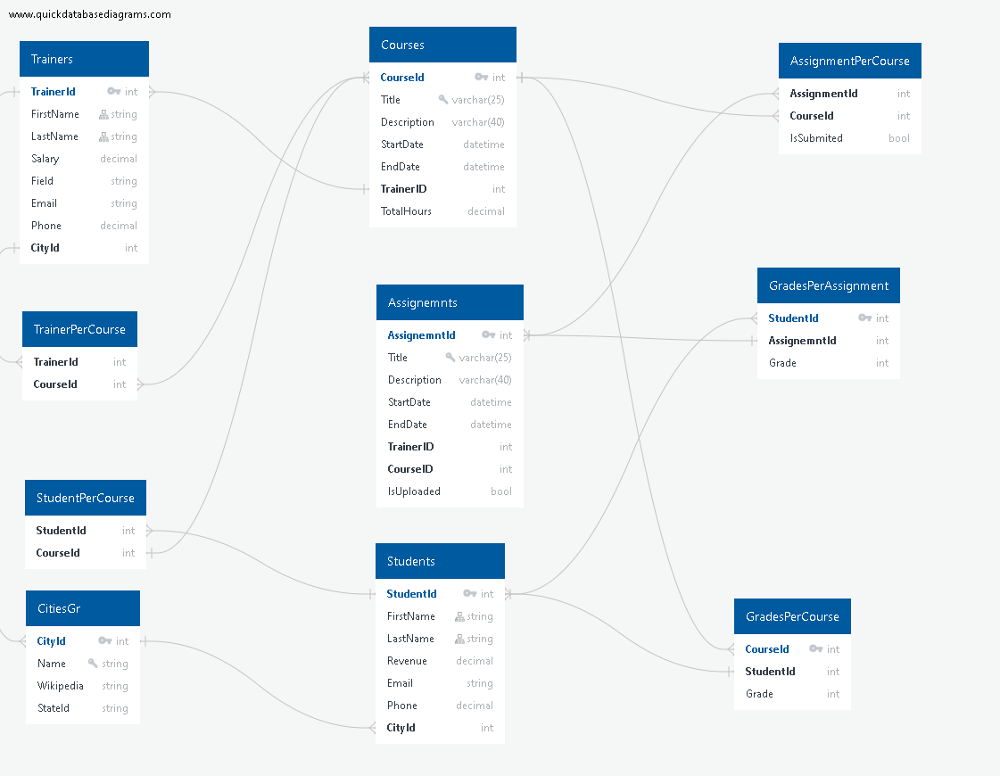

---------------------------------------------------------

-----------------------------------------------------

# Individual_Project_PartB
Assignment to practise <strong>SQL fundamentals</strong> connected with <strong>C#</strong> and <strong>Entity Framework</strong>.

<h2>Description</h2>

     <h3>Following PART A you need to implement the below functionality:</h3> 
    <ul>
    <li> <h4>Design the ERD of your system and verify it through an online tool such as https://sqldbm.com/(it requires a free account) [15 marks]</h4> </li>
    <li> <h4>Identify  any  other  tables  you  need  based  on  your  implementation  and construct them [15 marks]</h4> </li>
    <li> <h4>Make the schema of a database that can keep data for the main entities of the  assignment  and  name  the  tables  as:  Students,  Trainers,  Assignments, Courses [15 marks]</h4></li>
    <li> <h4>Populate the tables of the database with enough data [10 marks]</h4></li>
    <li> <h4>You need to produce sql queries that output the following [19marks in total]:</h4></li>
    <ul>
    <li> <h4>A list of all the students [2marks]</h4></li>
    <li> <h4>A list of all the trainers[2marks]</h4></li>
    <li> <h4>A list of all the assignments[2marks]</h4></li>
    <li> <h4>A list of all the courses[2marks]</h4></li>
    <li> <h4>All the students per course[2marks]</h4></li>
    <li> <h4>All the trainers per course[2marks]</h4></li>
    <li> <h4>All the assignments per course[2marks]</h4></li>
    <li> <h4>All the assignments per course per student[2marks]</h4></li>
    <li> <h4>A list of students that belong to more than one courses[3marks]</h4></li>
    </ul>
  <li> <h3>You also need to produce a small project that [26 marks]</h3></li>
  <ul>
      <li>makes  a  connection  to  the  database and  executes  the  above  sql queries[9 marks]</li>
      <li>makes a connection to the database and inserts inputdata from the keyboard to the following tables,</li>
      <ul>
       <li>students[2 marks]</li>
       <li>trainers[2 marks]</li>
       <li>assignments[2 marks]</li>
       <li>courses[2 marks]</li>
       <li>students per course[3 marks]</li>
       <li>trainers per course[3 marks]</li>
       <li>assignments per student per course[3 marks]</li>
      </ul>
  </ul>
  </ul>
  <h3>You    need    to    submit    all    the    produced    files    in    a    zip    file    named    by your_name_individual_partb.zip</h3>
    

------------------------------------------------------------------------------------------------------------------------------------------------------

📋Table of contents
=================

<!--ts-->

* [ApplicationDatabase](#applicationdatabase)
    * [ApplicationContext](#applicationcontext)
* [Migrations](#migrations)
    * [Configurations](#configurations)
* [Models](#)
    * [Enum](#enum)
      * [Choice](#choice)
      * [Difficulty](#difficulty)
      * [Notification](#notification)
      * [Stream](#stream)
      * [Subject](#subject)
      * [Typecourse](#typecourse)
   * [Assignment](#assignment)
   * [City](#city)
   * [Course](#course)
   * [Grade](#grade)
   * [State](#state)
   * [Student](#student)
   * [Trainer](#trainer)
* [Interfaces](#interfaces)
   * [ISimpleModel](#isimplemodel)
   * [IPerson](#iperson)
* [Services](#services)
   * [MockupRepository](#mockuprepository)
   * [MainMenu](#mainmenu)
   * [MyInsertDB](#myinsertdb)
* [Installation](#installation)
* [Technologies](#technologies)

  
   
   
<!--te-->

------------------------------------------------------------------------------------------------------------------------------

## SQL Schema

----------------------------------------------------------------------------------------------------------------------------------
## ApplicationDatabase
### ApplicationContext
## Migrations
### Configurations
## Models
### Student

| Type           | Properties       | Methods |
| :---:          |     :---:        |  :---:  |
| int            | ID     | get, set   |
| string            | FirstName     | get, set   |
| string         | LastName      | get, set    |
| double         | PhoneNumber       | get, set    |

### Trainer

| Type           | Properties       | Methods |
| :---:          |     :---:        |  :---:  |
| int            | ID     | get, set   |
| string            | FirstName     | get, set   |
| string         | LastName      | get, set    |
| double         | PhoneNumber       | get, set    |

### Course

| Type           | Properties       | Methods |
| :---:          |     :---:        |  :---:  |
| int            | ID     | get, set   |
| string            | FirstName     | get, set   |
| string         | LastName      | get, set    |
| double         | PhoneNumber       | get, set    |

### Assignment

| Type           | Properties       | Methods |
| :---:          |     :---:        |  :---:  |
| int            | ID     | get, set   |
| string            | FirstName     | get, set   |
| string         | LastName      | get, set    |
| double         | PhoneNumber       | get, set    |

### City

| Type           | Properties       | Methods |
| :---:          |     :---:        |  :---:  |
| int            | ID     | get, set   |
| string            | FirstName     | get, set   |
| string         | LastName      | get, set    |
| double         | PhoneNumber       | get, set    |
### State

| Type           | Properties       | Methods |
| :---:          |     :---:        |  :---:  |
| int            | ID     | get, set   |
| string            | FirstName     | get, set   |
| string         | LastName      | get, set    |
| double         | PhoneNumber       | get, set    |

### Grade

| Type           | Properties       | Methods |
| :---:          |     :---:        |  :---:  |
| int            | ID     | get, set   |
| string            | FirstName     | get, set   |
| string         | LastName      | get, set    |
| double         | PhoneNumber       | get, set    |

### Enum
#### Choice

#### Difficulty

#### Notification

#### Stream

#### Subject

#### TypeCourse

## Interfaces

### ISimpleModel

### IPerson

## Services 

### MockupRepository

| Type           | Properties       | Methods |
| :---:          |     :---:        |  :---:  |
| int            | ID     | get, set   |
| string            | FirstName     | get, set   |
| string         | LastName      | get, set    |
| double         | PhoneNumber       | get, set    |

### MainMenu

### MyInsertDB

| Type           | Properties       | Methods |
| :---:          |     :---:        |  :---:  |
| int            | ID     | get, set   |
| string            | FirstName     | get, set   |
| string         | LastName      | get, set    |
| double         | PhoneNumber       | get, set    |

## Views

### AssignmentView

### CourceView

### StudentView

### TrainerView

## Installation
## Technologies

##### [Back to >Top<](#Individual_Project_PartB) #####
